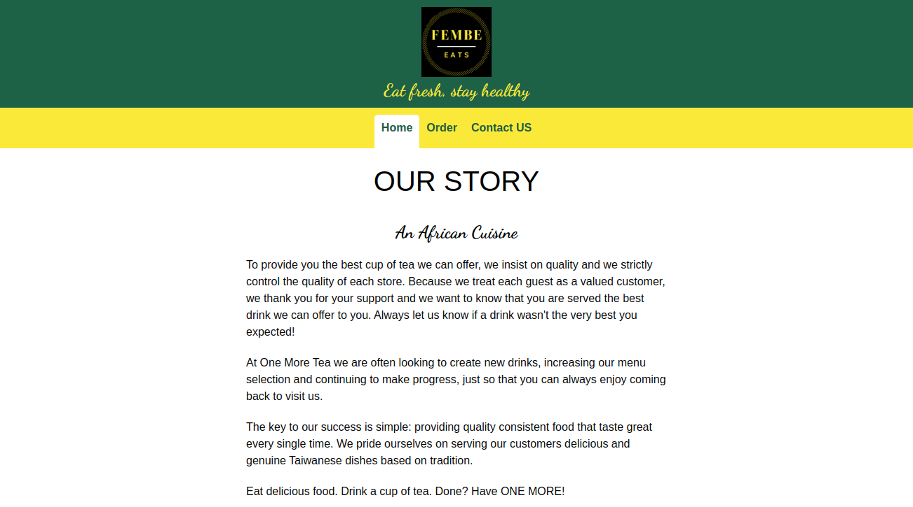
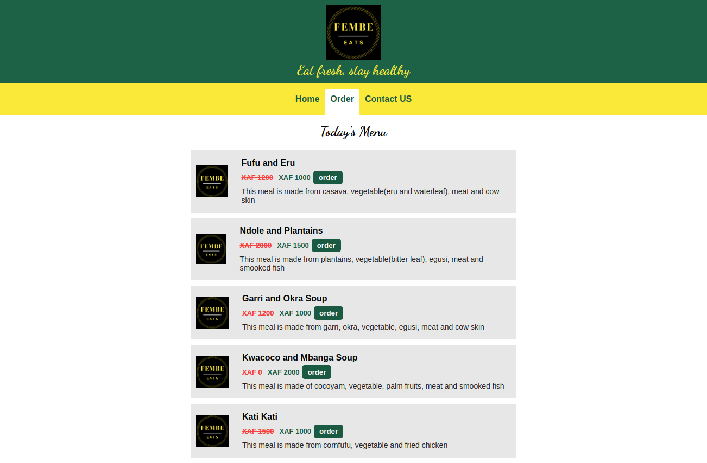

# RESTAURANT PAGE

## Definition

A website for a restaurant.

## About the Project

This project is about building a website using ES6 modules and Webpack to import these modules. The entire DOM is populated and manipulated using javascript.


-


The DOM Elements are build mainly from JS:
The JS has the following structure

- About module
- Menu module
- Contact module
- Active module
- PageLoad module

## Built With

- HTML5
- CSS3
- Javascript

## Live Demo

[Live Demo Link](https://misori-simon.github.io/library/)


## Getting Started


**To get a local copy up and running follow these simple example steps.**

### clone the repo.
- in your terminal,  run
``` git clone https://github.com/Misori-simon/restaurant_page.git ```
- open the directory
### Without Node.js
- Open project directory.
- Open dist directory.
- Navigate index.html with your browser.
### With Node.js
- Open project directory.
- Run the ```npm install```
- npm run start: dev to start the start application.


## Authors

👤 **Misori Simon**

- GitHub: [Misori-simon](https://github.com/Misori-simon/)
- Twitter: [@misori_simon](https://twitter.com/misori_simon)
- LinkedIn: [Misori Simon](https://cm.linkedin.com/in/misori-simon-05906219b)

## 🤝 Contributing

Contributions, issues, and feature requests are welcome!

## Show your support

Give a ⭐ if you like this project!

## Acknowledgments

-  [The Odin Project](https://www.theodinproject.com/)


